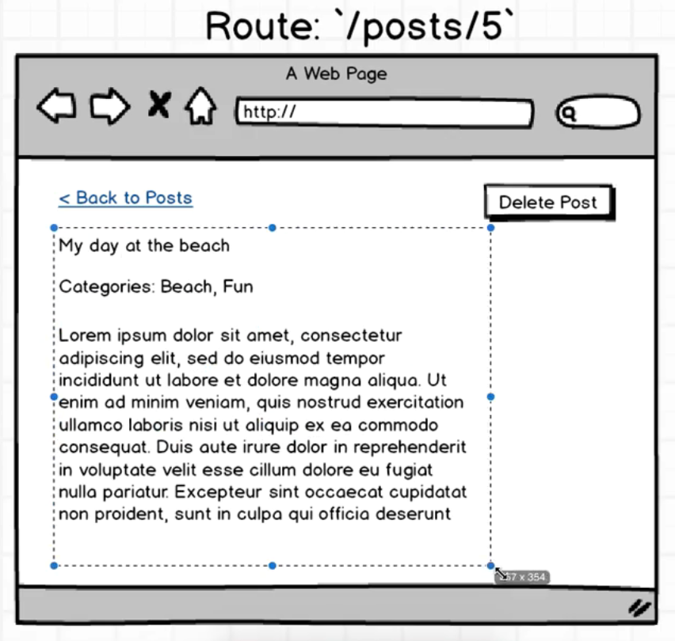
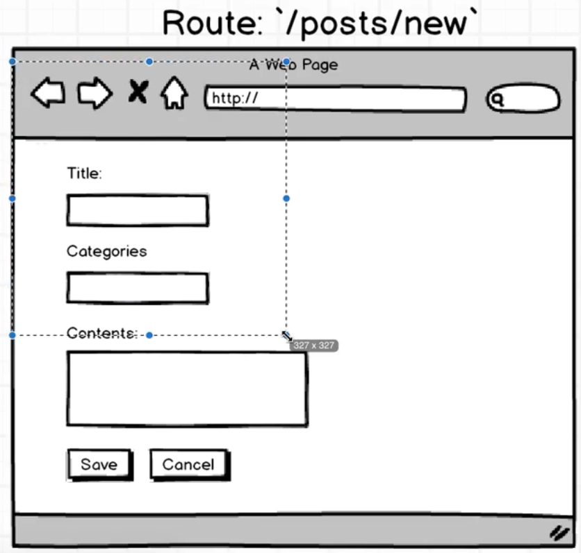

项目源码：https://github.com/StephenGrider/ReduxCasts
API文档：http://reduxblog.herokuapp.com/

 

> 项目介绍

 

 

> https://github.com/StephenGrider/ReduxSimpleStarter

 

> 把下载下来的所有文件保存到本地目录中

 

> npm install

 

> npm start

 

> http://localhost:8080/

 

