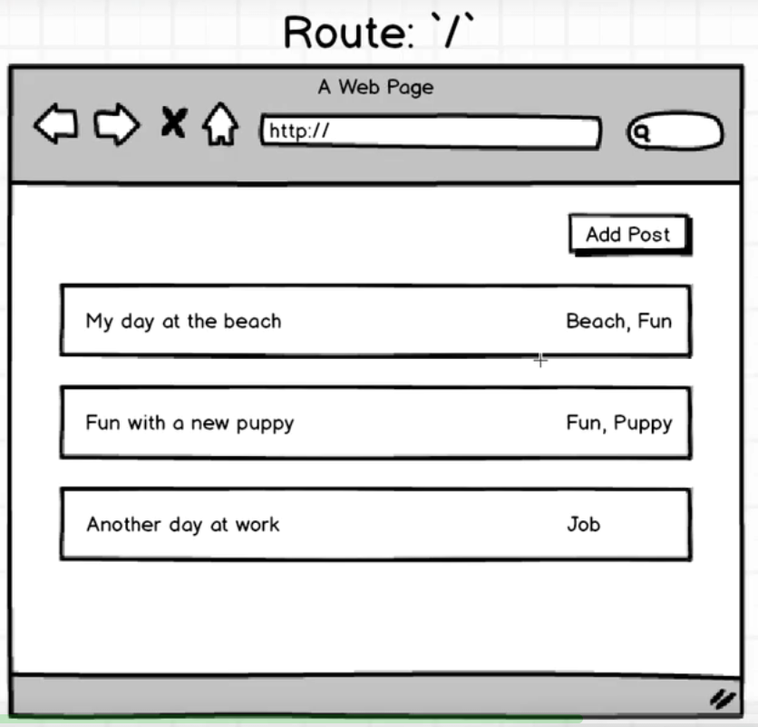

我们要做的其中一个效果是这样的：

当输入/的时候，显示一个blog列表，这应该也是一个组件。

 

而现在，路由是这样设置的：

	<Route path="/" component={App}>
也就是说，当输入/,显示App这个组件。

 

**如何既能显示App组件，又能显示blog列表组件呢？**

 

> src/components下创建posts_index.js, 这里用来定义blog列表组件

 

	import React from 'react';
	
	export default () => {
	    return 
List of blog posts

	};

 

> src/index.js

 

	import React from 'react';
	import ReactDOM from 'react-dom';
	import { Provider } from 'react-redux';
	import { createStore, applyMiddleware } from 'redux';
	
	import App from './components/app';
	import reducers from './reducers';
	
	import { Router, Route, browserHistory, IndexRoute } from 'react-router';
	import PostsIndex from './components/posts_index';
	
	const createStoreWithMiddleware = applyMiddleware()(createStore);
	
	const Greeting = () => {
	  return 
  Hey there
;
	};
	
	ReactDOM.render(
	  <Provider store={createStoreWithMiddleware(reducers)}>
	    <Router history={browserHistory}>
	        <Route path="/" component={App}>
	            <IndexRoute component={PostsIndex}/>
	            <Route path="greet" component={Greeting} />
	        </Route>
	    </Router>
	  </Provider>
	  , document.querySelector('.container'));

当设置了IndexRoute的时候意味着：IndexRoute是被嵌套路由中有最高的优先级。

 

当浏览器地址是/的时候，首先会来到最外层的Route显示App组件，接着往里走，IndexRoute拥有最高的优先级，就显示PostsIndex组件。

 

