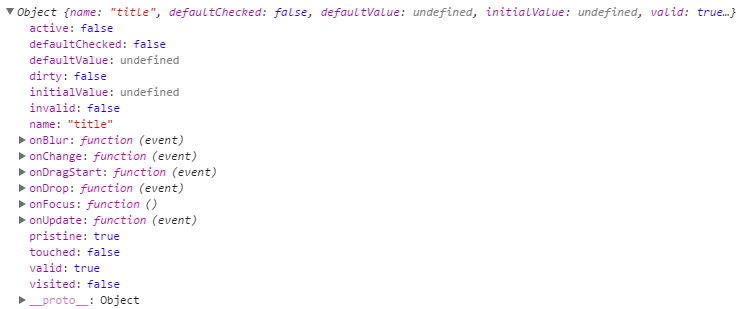

在上一节中，redux-form中的reduxForm就像connec一样把组件和state链接了起来。所以，组件就应该会有redux-form的一些属性或方法。

 

> src/components/posts_new.js

 

	import React, { Component } from 'react';
	import { reduxForm } from 'redux-form';
	
	class PostsNew extends Component{
	    render(){
	        
	        //const title = this.props.fields.title;
	        const { fields: {title, categories, content }, handleSubmit } = this.props;
	        
	        console.log(title);
	        
	        return (
	            <form onSubmit={handleSubmit}>
	                <h3>Create A New Post</h3>
	                

	                    <label>Title</label>
	                    <input type="text" className="form-control" />
	                

	            
	                

	                    <label>Catgories</label>
	                    <input type="text" className="form-control" />
	                

	
	                

	                    <label>Content</label>
	                    <textarea className="form-control" />
	                
  
	            
	                <button type="submit" className="btn btn-primary">Submit</button>
	            </form>
	        );
	    }
	}
	
	export default reduxForm({
	    form: 'PostsNewForm',
	    fields: ['title', 'categories', 'content']
	})(PostsNew);

组件又了handleSubmit, fields,等等，并把组件的title属性打印了出来。

 

> http://localhost:8080/posts/new

 

 

> src/components/posts_new.js

 

如何把如此多的属性和事件交给Input呢？类似这样：

	<input type="text" className="form-control" {...title} />
	<input type="text" className="form-control" {...categories} />
	<textarea className="form-control"  {...content} />

从此刻起，组件有的属性和方法都交给了表单元素。
**
接下来，应该要定义提交表单的action了。**

 

> src/actions/index.js

 

	import axios from 'axios';
	
	export const FETCH_POSTS = 'FETCH_POSTS';
	export const CREATE_POST = 'CREATE_POST';
	
	
	const ROOT_URL = 'http://reduxblog.herokuapp.com/api';
	const API_KEY = '?key=lkajdsfapipwietpw';
	
	export function fetchPosts(){
	    
	    const request = axios.get(`${ROOT_URL}/posts${API_KEY}`);
	    return {
	        type: FETCH_POSTS,
	        payload: request
	    };
	}
	    
	    
	export function createPost(props){
	    const request = axios.post(`${ROOT_URL}/posts${API_KEY}`, props);
	    
	    return {
	      type: CREATE_POST,
	      payload: request
	    };
	}

 

**如何把action与组件映射起来呢？和connect类似。**

 

> src/components/posts_new.js

 
	
	import { createPost } from '../actions/index';
	<form onSubmit={handleSubmit(this.props.createPost)}>
	...
	// connect:第一个参数是mapStateToProps, 第二个参数是mapDispatchToProps
	// reduxForm:第一个参数是config, 第二个参数是mapStateToProps, 第三个参数是mapDispatchToProps
	
	export default reduxForm({
	    form: 'PostsNewForm',
	    fields: ['title', 'categories', 'content']
	}, null, { createPost })(PostsNew);
 

完整如下：

	import React, { Component } from 'react';
	import { reduxForm } from 'redux-form';
	import { createPost } from '../actions/index';
	
	class PostsNew extends Component{
	    render(){
	        
	        //const title = this.props.fields.title;
	        const { fields: {title, categories, content }, handleSubmit } = this.props;
	        
	        
	        
	        return (
	            <form onSubmit={handleSubmit(this.props.createPost)}>
	                <h3>Create A New Post</h3>
	                

	                    <label>Title</label>
	                    <input type="text" className="form-control" {...title} />
	                

	            
	                

	                    <label>Catgories</label>
	                    <input type="text" className="form-control" {...categories} />
	                

	
	                

	                    <label>Content</label>
	                    <textarea className="form-control"  {...content} />
	                
  
	            
	                <button type="submit" className="btn btn-primary">Submit</button>
	            </form>
	        );
	    }
	}
	
	// connect:第一个参数是mapStateToProps, 第二个参数是mapDispatchToProps
	// reduxForm:第一个参数是config, 第二个参数是mapStateToProps, 第三个参数是mapDispatchToProps
	
	export default reduxForm({
	    form: 'PostsNewForm',
	    fields: ['title', 'categories', 'content']
	}, null, { createPost })(PostsNew);

 

> http://localhost:8080/posts/new

 

已经能提交表单数据了。

 

