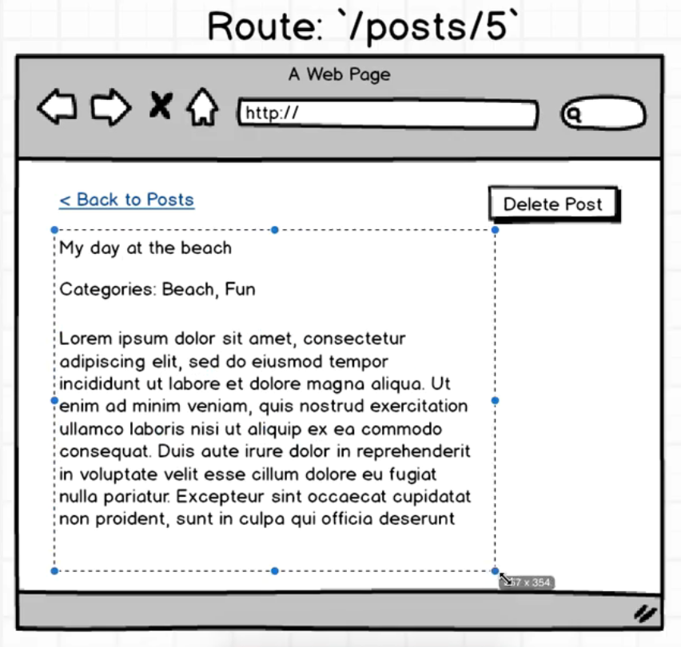

要做的效果是：

 

首先需要设置路由。

 

> src/index.js

 

	import React from 'react';
	import ReactDOM from 'react-dom';
	import { Provider } from 'react-redux';
	import { createStore, applyMiddleware } from 'redux';
	
	import App from './components/app';
	import reducers from './reducers';
	
	import { Router, Route, browserHistory, IndexRoute } from 'react-router';
	import PostsIndex from './components/posts_index';
	import PostsNew from './components/posts_new';
	import promise from 'redux-promise';
	import PostsShow from './components/posts_show';
	
	
	const createStoreWithMiddleware = applyMiddleware(
	    promise
	)(createStore);
	
	
	
	ReactDOM.render(
	  <Provider store={createStoreWithMiddleware(reducers)}>
	    <Router history={browserHistory}>
	        <Route path="/" component={App}>
	            <IndexRoute component={PostsIndex}/>
	            <Route path="posts/new" component={PostsNew} />
	            <Route path="posts/:id" component={PostsShow} />
	        </Route>
	    </Router>
	  </Provider>
	  , document.querySelector('.container'));

 

**路由参数如何获取呢？**

 

> src/components 下创建 posts_show.js

 

> src/components/posts_show.js

 

	import React, { Component } from 'react';
	
	class PostsShow extends Component{
	    render(){
	        return 
Show Post {this.props.params.id } 

	    }
	    
	    
	}

	export default PostsShow;

 

> http://localhost:8080/posts/5

 

报错：bundle.js:28398 Uncaught Error: Cannot find module "./ContextUtils"

 

> 修改package.json中react-router的版本

 

	  "dependencies": {
	    "axios": "^0.12.0",
	    "babel-preset-stage-1": "^6.1.18",
	    "lodash": "^3.10.1",
	    "react": "^0.14.3",
	    "react-dom": "^0.14.3",
	    "react-redux": "^4.0.0",
	    "react-router": "^3.0.0-alpha.1",
	    "redux": "^3.0.4",
	    "redux-form": "^4.1.3",
	    "redux-promise": "^0.5.3"
	  }

 

> npm install

 

